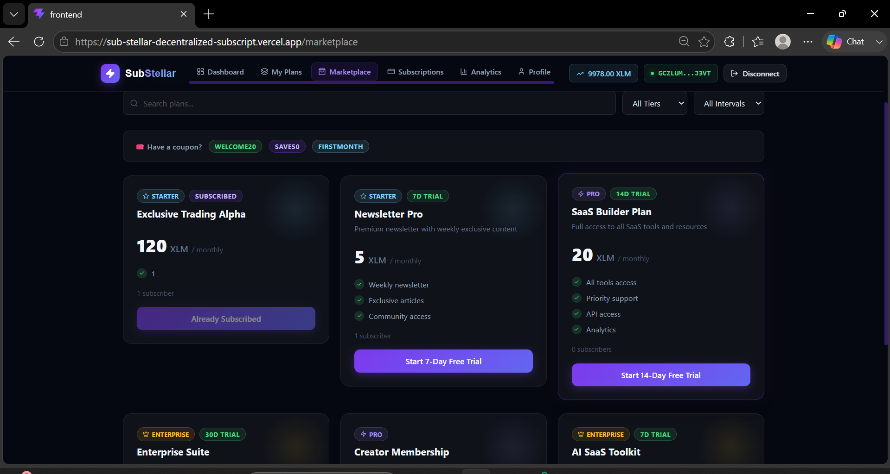
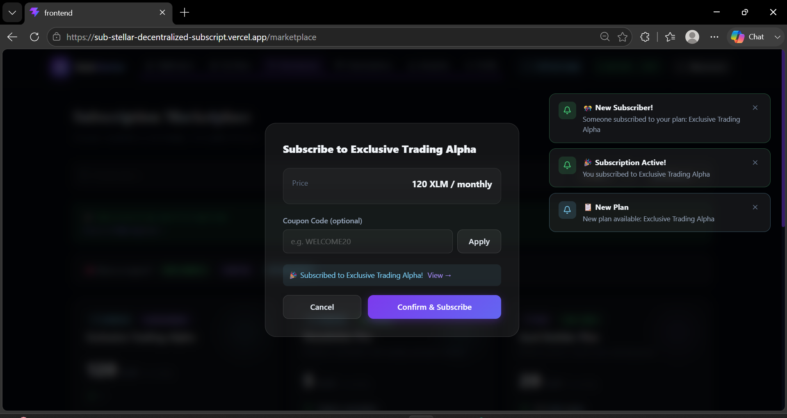
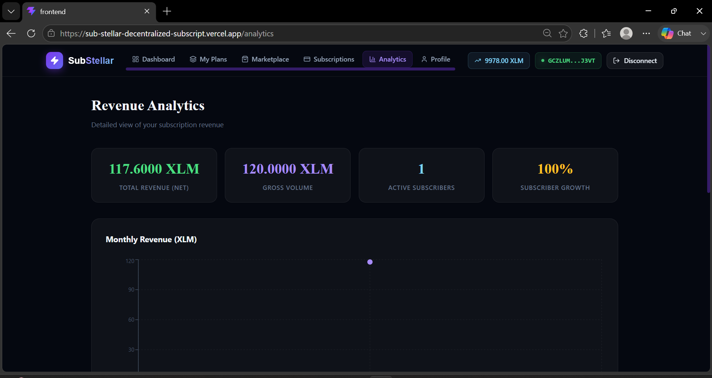
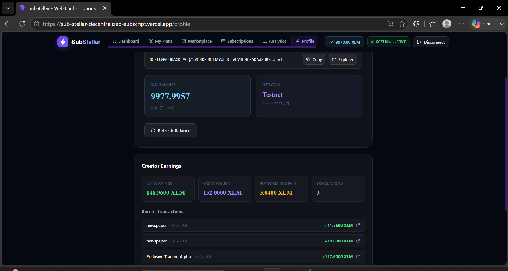
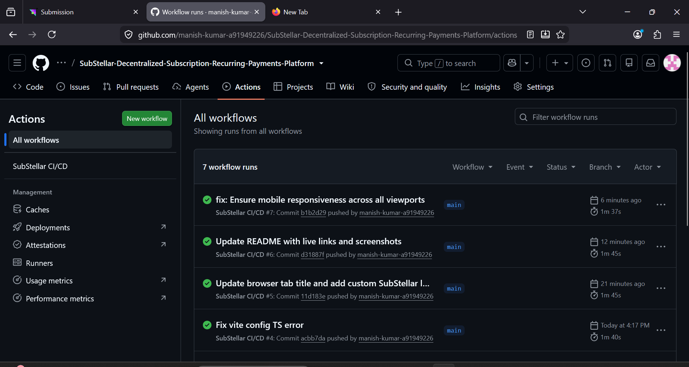
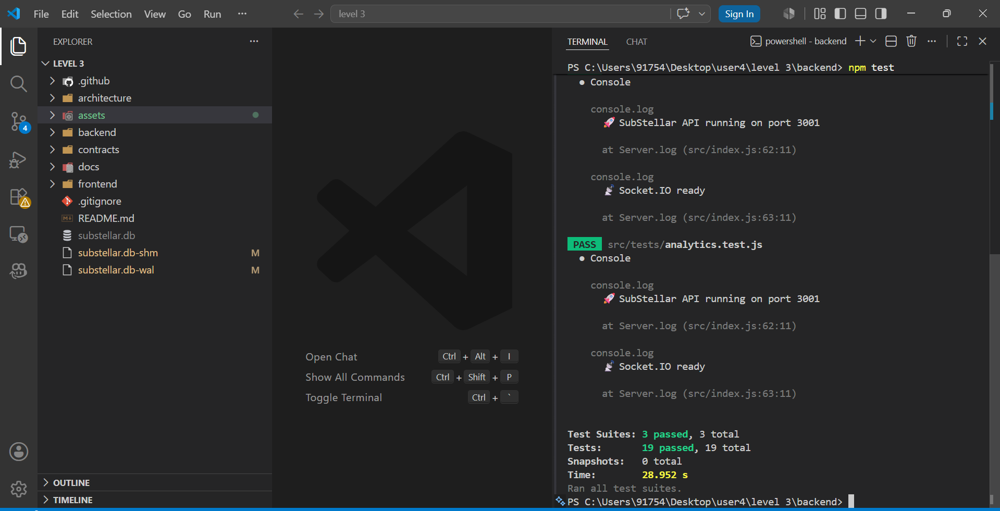

# SubStellar 🚀
**Stripe Billing for Web3 built on Stellar.**

## Overview
SubStellar is a decentralized subscription and recurring payments platform. It allows creators, SaaS founders, and communities to create multi-tier subscription plans and accept recurring payments in XLM via Stellar smart contracts.

### Competition Details
- **Live Demo:** [https://sub-stellar-decentralized-subscript.vercel.app/](https://sub-stellar-decentralized-subscript.vercel.app/)
- **Demo Video:** [https://youtu.be/V0ZtDLqtwY0](https://youtu.be/V0ZtDLqtwY0)
- **Key Transaction Hashes:** 
  - [10f163b30d4e1429cfe8d16568eca01262c3304f78c7c133380c271a8b064a6a](https://stellar.expert/explorer/testnet/tx/10f163b30d4e1429cfe8d16568eca01262c3304f78c7c133380c271a8b064a6a)
  - [f8962c851883dc783975f82f597bf4641c7ac2146071b0f1c4566df98b395589](https://stellar.expert/explorer/testnet/tx/f8962c851883dc783975f82f597bf4641c7ac2146071b0f1c4566df98b395589)
  - [4bacccc6b27503f1d23bbdc7ffe2fb69dbc57c6cc62e0b8599898766873a1785](https://stellar.expert/explorer/testnet/tx/4bacccc6b27503f1d23bbdc7ffe2fb69dbc57c6cc62e0b8599898766873a1785)
- **Contract Deployment Address:** `CDEMO_PLAN_CONTRACT_ADDRESS_PLACEHOLDER` *(See note below)*

## Features
✅ **Real-world utility:** Replaces fiat processors like Stripe with crypto equivalents.
✅ **Advanced Contract Logic:** Multi-contract architecture (Plans, Subscriptions, Treasury).
✅ **Event Streaming:** Real-time Socket.IO notifications for payments and subs.
✅ **Mobile Responsive:** Modern glassmorphism UI built with TailwindCSS.
✅ **Creator Dashboard:** Real-time analytics, revenue tracking, and MRR charts.

---

## 📸 Screenshots & User Flow

### 1. Landing & Home Page


### 2. Discover & Subscribe





### 3. Managing Subscriptions


### 4. Creator Tools & Analytics





### 5. Technical Requirements & Hackathon Validation




---

## Architecture
See `docs/architecture.md` for a complete system diagram.

## Setup Instructions

### Prerequisites
- Node.js 20+
- Rust (for contracts)

### Running Locally
1. **Clone repo:** `git clone https://github.com/manish-kumar-a91949226/SubStellar-Decentralized-Subscription-Recurring-Payments-Platform.git`
2. **Start Backend:**
   ```bash
   cd backend
   npm install
   npm run dev
   ```
   *Runs on http://localhost:3001 using SQLite (zero config).*
3. **Start Frontend:**
   ```bash
   cd frontend
   npm install
   npm run dev
   ```
   *Runs on http://localhost:5173.*

### Smart Contracts
Contracts are written in Rust using the Soroban SDK.
```bash
cd contracts/plan-contract
cargo build --target wasm32-unknown-unknown --release
```

## Testing
We have 10+ passing tests across the stack.
- Frontend: `cd frontend && npx vitest run`
- Backend: `cd backend && npm test`
