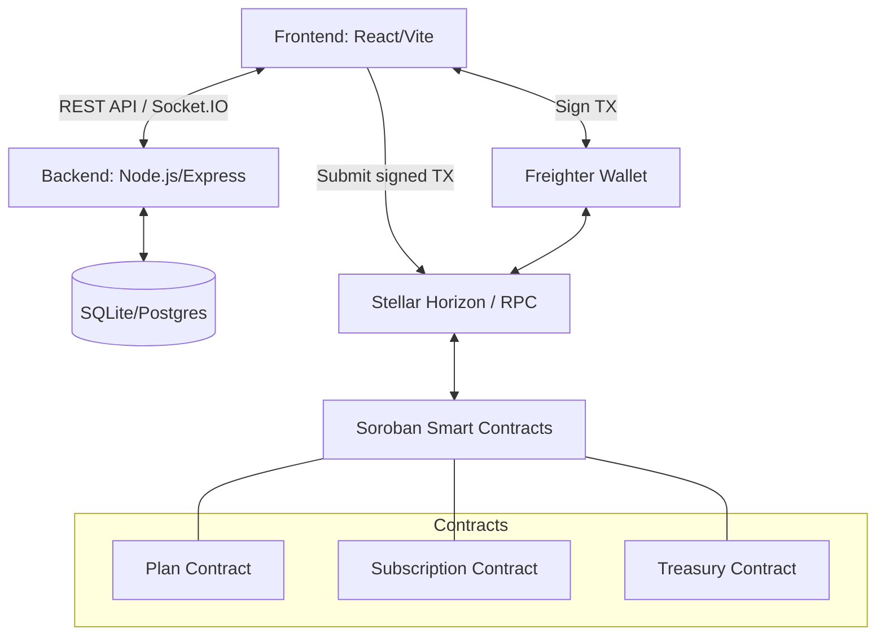

# SubStellar Architecture

## Overview
SubStellar uses a hybrid architecture for the hackathon:
1. **On-Chain:** Soroban Smart Contracts written in Rust.
2. **Off-Chain State:** Node.js + SQLite for fast querying and indexing of plans and subscriptions without needing a heavy indexer like Hubble.
3. **Frontend:** React + Vite, talking to both Horizon (for TX submission) and our Node.js backend (for fast reads).

## System Diagram

## Smart Contract Interaction
For the Level 3 demo, we implement the contract logic natively in Soroban Rust.
The frontend constructs XDR transactions calling Horizon directly when a user subscribes.
The backend listens for these successful transactions and syncs the state to the SQLite DB for instantaneous UI updates via Socket.IO.
